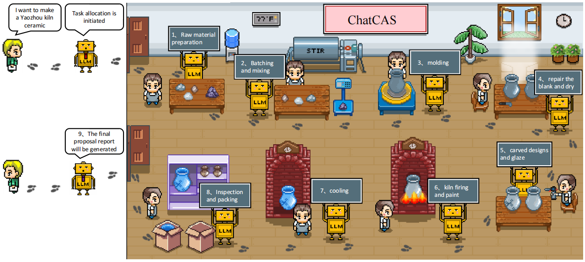

# HYY
# 🏺ChatCAS: Multimodal Ceramic Multi-Agent Studio (Consultation • Analysis • Generation)



**🔬 Agent Construction Framework for the Ceramics Domain: Application Demonstrations in Ceramic Knowledge Question-Answering and Image Analysis & Generation**  
**📅 Estimated completion time of open source project: early 2026**

---

## 📖 Project Overview
This project aims to develop the first large language model (LLM) system specifically for the ceramic field. This system integrates rich multimodal knowledge of ceramics, multimodal evaluation datasets, and a collaborative multi-agent framework, all of which are designed to enhance expert consultation, image analysis, and creative decision-making throughout the entire ceramic design and production process.

We propose the following key modules:：
- 📊 **EvalCera**：The first multimodal evaluation dataset in the ceramics domain
- 🏺 **CeramicGPT**：The first large language model tailored for the ceramics field, capable of intelligently handling knowledge-based Q&A in the ceramics field.
- 🤖 **ChatCAS**：Driven by CeramicGPT and GPT-4o. It categorizes tasks related to the various stages of a ceramic studio, completing collaborative work through role-playing and task goal consensus. ChatCAS can effectively handle comprehensive tasks in the ceramics field, including Q&A, image analysis, and generation.
The project is dedicated to promoting the deep integration of artificial intelligence and ceramics, and supporting more scientific research and industrial application explorations.

The project is dedicated to promoting the deep integration of artificial intelligence and ceramics, and supporting more scientific research and application exploration.

---

## 🚀 Model Availability

The **CeramicGPT** model and related resources are available on [Hugging Face](https://huggingface.co/HanYongyi/CeramicGPT).  
---
## 📌 Open Source Roadmap

We will open source gradually in the following stages：

| phase |  content | Time node (expected) |
|------|------|----------------|
| ✅ step 1 | Part of ceramic knowledge dataset | Q2 2025 |
| 🚧 step 2 | EvalCera evaluation base set | Q3 2025 |
| ⏳ step 3 | ChatCAS framework code and examples | Q4 2025 |

👉 The complete warehouse content will be unified and open source after all research work is completed and sorted out, which is expected to be by the end of 2025.


## 💻 Mini Program: Porcelain Language Intelligent Q&A and Image Analysis Mini-Program

To make the ChatCAS system more accessible and intuitive, we have developed a WeChat Mini Program named “瓷语”, which integrates large model–based ceramic knowledge Q&A and multimodal image analysis.
Due to commercial collaboration confidentiality, the source code of this mini program is partly open-sourced in this repository under the folder /MiniProgram/.

Key Features:

Intelligent Q&A via text or voice input, supporting multi-turn contextual dialogue.

Image-based analysis of ceramic artifacts, identifying shape, texture, and style patterns.

Integration with ChatCAS for creative interpretation and design assistance.

Lightweight WeChat-native UI for smooth interaction and visualization.


## 📁 Directory Structure

```bash
CeramicGPT/
Mini Program/
├── data/                       # Knowledge Graph and Evaluation Set (Coming soon)
├── models/                     # Fine-tuning model related content (open source planned)
├── agents/                     # Multi-agent framework code
├── docs/                       # Project documentation and experimental details
└── README.md                   # Project description
```
## 🔄 Reproducibility and Data Standards

To ensure transparency and reproducibility, we have made the following resources publicly available in this repository:

- **Reproducibility elements**:  
  - Data split scripts for training/validation/test sets
  - Fixed random seed configurations to guarantee consistent results
  - Detailed hardware specifications (GPU/CPU environment), including tested environments
  - Minimum GPU requirement: 24GB VRAM (e.g., NVIDIA RTX 4090 or higher)

These resources enable independent verification of all reported results in the paper.

- **Data copyright and cleaning standards**:  
  - Image data were mainly collected from **museum collections** and **Baidu Baike**.  
  - Copyright attribution has been clarified, and only publicly shareable resources are included.  
  - A standardized data-cleaning process (removal of duplicates, low-quality or unclear samples) has been applied to ensure the reliability and fairness of the dataset.

👉 For details, please refer to the (./docs) folder and experiment notes in this repository.
---

## 📜 License

The project will be open source under the Apache 2.0 License or MIT License for academic and commercial use. The final license will be specified at the time of the open source release.
---

## 📬 Contact

If you have the intention of cooperation or exchange, please contact us through the following ways：

- 📧 Email: 1399780501@qq.com(Yongyi Han); 1241917171@qq.com (Diandong Liu)

> “让古老的瓷火与新生的大模型在同一炉温中交融”
